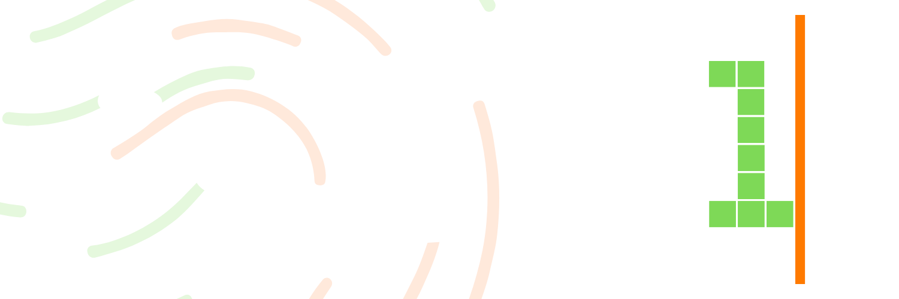

  <h1 class="doc-hero-title">What is</h1>
  

1Edge is a **human-first token launchpad on Solana**, a single platform that fuses three things most launchpads keep separate:

* **Automated token deployment**, launch a token in seconds with a bonding curve, built-in anti-bot protection, and an automated path to a real DEX.
* **A professional trading terminal**, live charts, depth, raw order logs, holder distribution, and one-click execution.
* **A native Social-Fi layer**, profiles backed by real, on-chain-verified performance stats, global chat, token communities, and `@user` / `$ticker` tagging.

The thread that ties it together is **proof of humanity**. Every participant verifies they are a real person and binds that status to a single wallet, so launches are made up of humans, not swarms of scripted wallets.

> ℹ️ **New here?** Start with [The Broken State of Solana Launches](introduction/the-problem.md) to understand the problem 1Edge is built to solve, then see [The Ecosystem Flywheel](introduction/core-flywheel.md) for how the pieces reinforce each other.

## The three pillars

### 1. Launch

Deploy a token through one of two frameworks, **Edge Mode** for a simple, fixed-fee launch, or **EdgeTek Mode** for fully configurable fee, burn, and liquidity mechanics. Both ride a bonding curve to a fixed graduation target and migrate automatically into Meteora liquidity. See [Protocol Mechanics](protocol/edge-mode.md).

### 2. Trade

Every token lives inside a full trading terminal: real-time charts, volume depth, live trade logs, top-holder analysis, slippage controls, and position tracking, with developer-transparency tags (like atomic dev-buys) surfaced automatically. See [Advanced Terminal Trading](terminal/interface.md).

### 3. Build your edge

Refer other verified humans and earn a share of their trading fees, climb a five-rung tier system for rising fee rebates, and build a reputation backed by on-chain-verified stats through Edge Social. See [Account Tiers & Referrals](rewards/tier-matrix.md).

## Why "human-first" matters

On most launchpads, the first seconds of a launch are dominated by bots, bundled wallets, same-block snipers, and MEV extractors that take the early supply and sell it back to the humans who arrive moments later. 1Edge attacks this at the **protocol level**: verified humanity, same-block bundle blocking, optional buy caps and cooldowns, and automated anti-vamp detection. The result is launches that give real participants a fair start.

> ✅ **One wallet. One human. Verified on-chain.** That's the foundation everything else is built on.

