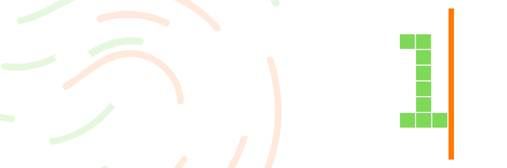

  <h1 class="doc-hero-title">What is</h1>
  

1EDGE is a **human-first token launchpad on Solana and on Robinhood Chain**, an Ethereum-compatible network. It is a single platform that fuses three things most launchpads keep separate:

* **Automated token deployment**, launch a token in seconds with a bonding curve, built-in anti-bot protection, and an automated path to a real DEX.
* **A professional trading terminal**, live charts, depth, raw order logs, holder distribution, and one-click execution.
* **A native Social-Fi layer**, profiles backed by real, on-chain-verified performance stats, global chat, token communities, and `@user` / `$ticker` tagging.

The thread that ties it together is **1EDGE Proof of Humanity**. Every participant passes a set of checks and binds the pass permanently to a single wallet, so a swarm of scripted wallets has to be paid for one wallet at a time.

> ℹ️ **New here?** Start with [The Broken State of Solana Launches](introduction/the-problem.md) to understand the problem 1EDGE is built to solve, then see [The Ecosystem Flywheel](introduction/core-flywheel.md) for how the pieces reinforce each other.

## The three pillars

### 1. Launch

Deploy a token in **Edge Mode** for a simple, fixed-fee launch, **EdgeTek Mode** for configurable fee, burn, and liquidity mechanics, or **EDGEstocks** to price your token in a tokenised stock. Every launch rides a bonding curve to a fixed graduation target and migrates automatically into a real DEX pool: Meteora on Solana, Uniswap v4 on Robinhood Chain. See [Protocol Mechanics](protocol/edge-mode.md).

Then choose where it trades. A **1EDGE launch** keeps the curve on 1edge.app. An **[open launch](protocol/open-launches.md)** puts your token on Meteora from its first trade, visible on every terminal, while only pass holders can buy until it graduates.

### 2. Trade

Every token lives inside a full trading terminal: real-time charts, volume depth, live trade logs, top-holder analysis, slippage controls, and position tracking, with developer-transparency tags (like creator dev-buys) surfaced automatically. See [Advanced Terminal Trading](terminal/interface.md).

### 3. Build your edge

Refer other people who mint a pass and earn a share of their trading fees, climb a five-rung tier system for rising fee rebates, and build a reputation backed by on-chain-verified stats through Edge Social. See [Account Tiers & Referrals](rewards/tier-matrix.md).

## Two chains, one account

1EDGE runs on **Solana** and on **Robinhood Chain**, an Ethereum-compatible network. The same launchpad, the same terminal, the same social layer, on both.

One account holds a wallet on each chain. You sign in with a Solana wallet, or with an Ethereum-style wallet on Robinhood Chain, and you link the second one from Settings. It stays one profile: one handle, one cabinet, one track record, whichever side you're trading. See [Profiles & Handles](social/profiles-and-identity.md).

What's the same on both: the launch modes, the fee rates, the guardrails, proof of humanity, Edge Social, tiers and referrals. What differs is the currency a curve fills in and the DEX a launch graduates to, and every page that matters names which is which.

> ℹ️ **Both chains are on their test networks today.** The Solana side runs on devnet; the Robinhood side runs on Robinhood Chain's testnet. Nothing on either is real money yet. See the [Smart Contract Directory](support/contracts.md).

## Why "human-first" matters

On most launchpads, the first seconds of a launch are dominated by bots, bundled wallets, same-block snipers, and MEV extractors that take the early supply and sell it back to the humans who arrive moments later. 1EDGE attacks this at the **protocol level**: a pass that has to be paid for one wallet at a time, same-block bundle blocking, optional buy caps and cooldowns, and automated anti-vamp detection. The result is launches that give real participants a fair start.

> ✅ **One wallet. One pass. Soulbound on-chain.** That's the foundation everything else is built on.

