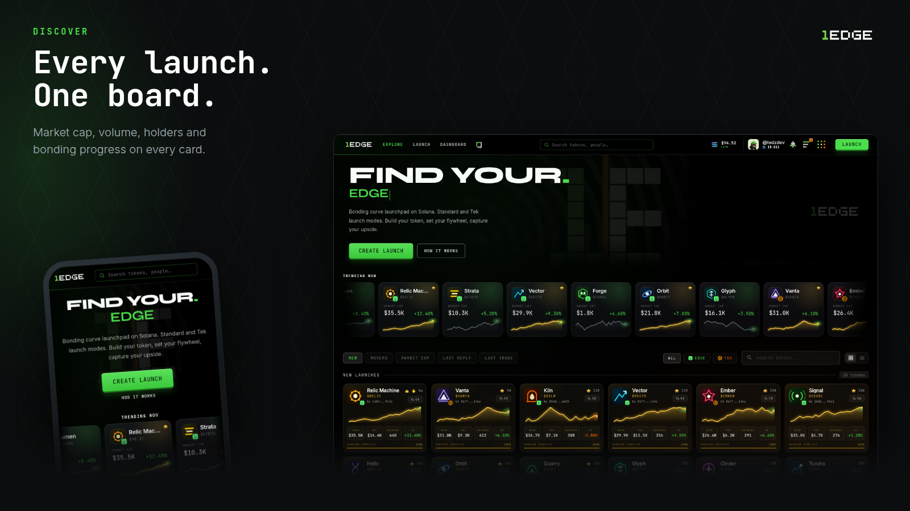

# Getting Started

## Browse first, no account needed

1Edge is **open by default**. Charts, token pages, the social feed, profiles, all of it is browsable without connecting a wallet or making an account. Look around as long as you like; the platform only asks you to connect at the moment you try to do something that needs it.

## The five-minute setup

When you're ready to trade, launch, or post:

1. **Connect your wallet.** Any major Solana wallet works, and you choose which; 1Edge sticks to the one you picked.
2. **Verify you're human.** One short challenge, see [The Proof of Humanity NFT](proof-of-humanity.md).
3. **Mint your pass.** Your Proof of Humanity NFT binds your wallet to a verified account.
4. **Claim your handle.** Pick a username, add an avatar and bio, that's your identity across [Edge Social](../social/edge-social-engine.md).
5. **Go.** Trade, launch, post, call. Everything you do from here builds your [provable track record](../social/verified-metrics.md).

## Finding your way around

The top bar is the same on every page:

* **EXPLORE**, the board of every launch: trending, new, movers, market cap, filterable by mode.
* **LAUNCH**, deploy your own token, see [The Launch Blueprint](../creators/launch-blueprint.md).
* **DASHBOARD**, your [wallet](../terminal/execution-engine.md#the-in-app-wallet), positions, watchlist, fees, and settings.
* **The Edge Social mark**, the feed, your messages, and communities.
* **Search**, tokens by name, ticker, or contract address, and people by handle.
* **Your wallet button**, balance, connect state, and the account menu.

### On your phone

The same places, arranged for a thumb: navigation condenses into a **bottom icon bar**, your wallet control docks to the bottom edge, and every surface, chart, feed, DMs, trade panel, has a mobile layout. You can also [install 1Edge as an app](../social/notifications.md#on-your-phone) for full-screen trading and push notifications.

## The tour

The idea of the platform, in frames:

<figure style="margin:0"><figcaption style="font-size:.75rem;color:#888;margin-top:4px">Every launch opens to verified humans, not bots.</figcaption></figure><figure style="margin:0"><figcaption style="font-size:.75rem;color:#888;margin-top:4px">One wallet, one human, the Proof of Humanity pass.</figcaption></figure><figure style="margin:0"><figcaption style="font-size:.75rem;color:#888;margin-top:4px">Find launches on one board, guarded by design.</figcaption></figure><figure style="margin:0"><figcaption style="font-size:.75rem;color:#888;margin-top:4px">Two modes: Edge keeps it simple, EdgeTek engineers the fees.</figcaption></figure><figure style="margin:0"><figcaption style="font-size:.75rem;color:#888;margin-top:4px">Your profile carries a track record the chain can prove.</figcaption></figure><figure style="margin:0"><figcaption style="font-size:.75rem;color:#888;margin-top:4px">Make calls the market can hold you to.</figcaption></figure>

## Related

* [The Proof of Humanity NFT](proof-of-humanity.md)
* [Reading the Terminal](../terminal/interface.md)
* [The Edge Social Engine](../social/edge-social-engine.md)
