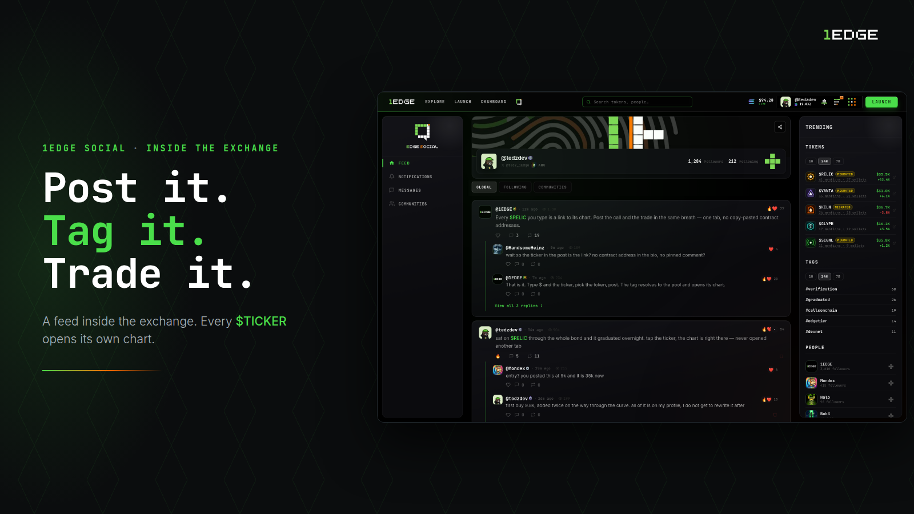
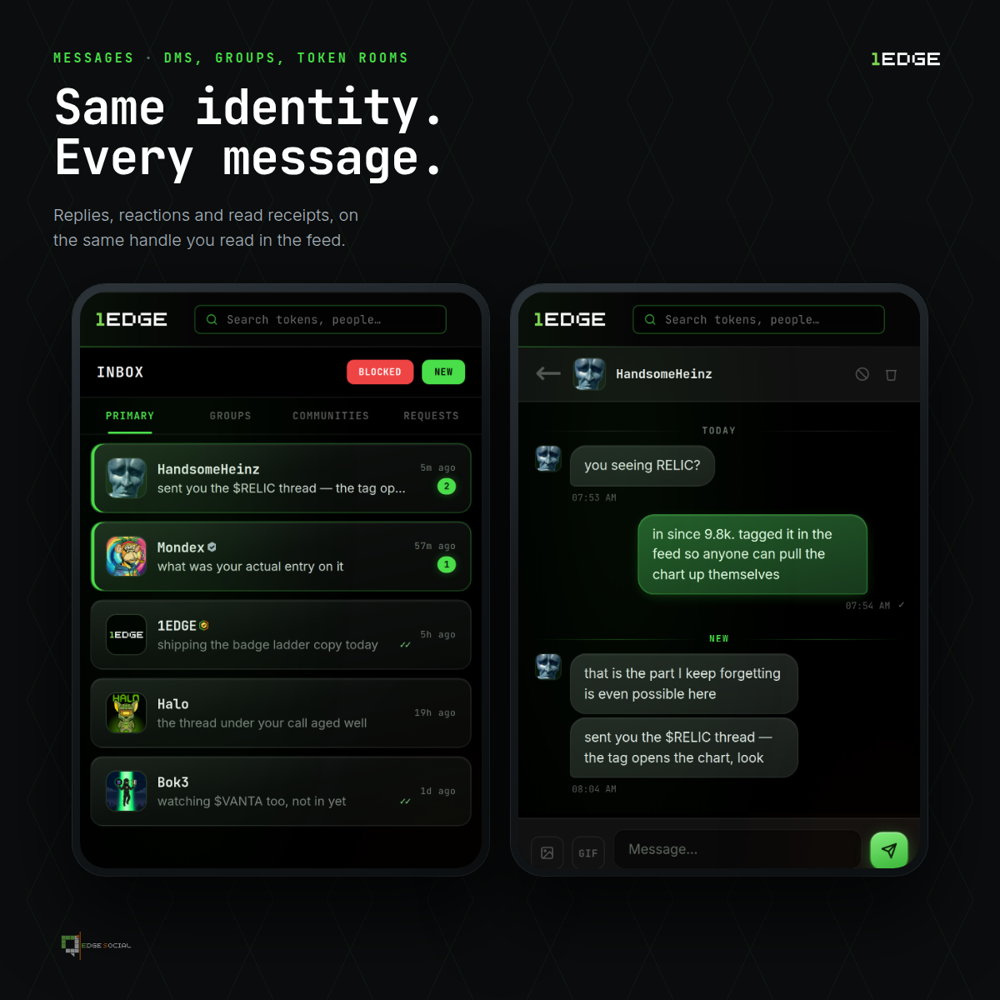
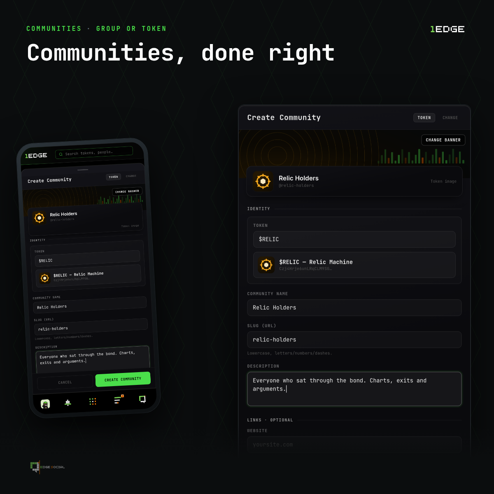

# The Edge Social Engine 

Edge Social is the social layer built into 1Edge. It's where discovery happens, where traders talk, share, and find their next trade, all next to the markets themselves instead of scattered across other apps.

<video src="../../assets/social-tour.mp4" controls muted loop playsinline style="width:100%;border-radius:10px;margin:.6em 0" aria-label="A tour of Edge Social"></video>

## Global feed

A platform-wide feed where traders post takes, share launches, and follow each other. Every account carries its own [on-chain track record](verified-metrics.md), so you can always check whether a poster's history backs up their takes.

* **Follow** traders and creators to build your own timeline.
* **Post** updates, calls, and commentary.
* **Discover** launches and people through what the community is talking about.

## Posting

Post text, images, GIFs, or video, to the global feed or into a community. Everything you'd expect from a feed is here:

* **Replies & threads**, conversations nest under the post.
* **Reactions**, quick sentiment without writing a comment.
* **Reposts & quotes**, pass a post on as-is, or with your own take on top.

## Tags & mentions

Reference anything, and it links:

* **`@user`**, mention any profile; it links straight to them, and they're notified.
* **`$ticker`**, reference any token; it links straight to its terminal page.

Tagging turns the feed and chat into a navigable map of the whole ecosystem, every person and every market is one click away.

## Making calls

A **call** is a public, timestamped claim on a token. When you make one, 1Edge **snapshots the token's market cap at that exact moment**, server-side, from live data. You can't backdate it, tweak it, or type your own numbers.

* The call posts to the feed as a **call card** drawn on the token's own artwork, showing where you called it and the move since.
* **One open call per token.** No re-posting the same claim to bump it.
* You can **update a call**, but only once something has actually happened, a meaningful move since your last marker, or enough time passed. An update is a fresh post that shows the chain, not a bump button.
* Calls are a **permanent record**. That's the point: anyone can check what you called and where it went.

## Sharing your PnL

Share a position straight from the token page as a **PnL card**: entry market cap, current market cap, and your percentage, with the option to show your multiplier.

> ✅ The numbers are **computed by 1Edge from your actual trades**, you don't type them in. A shared PnL on 1Edge can't be doctored.

## Chat

Chat on 1Edge is a **full messaging system**, and it's available on **every page** of the app, including right on the token page alongside the chart:

* **Direct messages**, private 1:1 conversations, **end-to-end encrypted**, encrypted on your device, so only you and the other person can read them, with a request step so strangers can't land in your inbox uninvited.
* **Group chats**, make a room, bring your people.
* **Community chats**, every token community has its own live room, creator and holders in one place as the curve moves.

## Token communities

Every launch gets its own **community hub**, tied directly to the token. It's the token's home base, a place for the creator to post updates and for holders to gather, separate from the noise of the global feed.

* Keyed to the token, so the community persists from bonding curve through graduation.
* Creator updates, announcements, and discussion in one place.
* Linked straight from the token's [terminal](../terminal/interface.md) page.

## Sharing beyond 1Edge

Every post, call, PnL share, profile, and token page has a **share** action: native share, X, Telegram, or copy link. And when a 1Edge link lands off-platform, it **unfurls into a rendered card**, a call shows its ticker and move, a PnL share its numbers, a profile its badge and record. The claim survives the trip instead of becoming a bare link.

## Kept safe

Anything on the platform, a post, a DM, an account, can be **reported in a couple of taps**, and reports are reviewed by humans against a clear, escalating moderation ladder. See [Reporting & Moderation](safety-and-moderation.md).

## Built on real identity

Underneath all of it sits the 1Edge profile: a persistent identity with a [real on-chain track record](verified-metrics.md) behind it. When someone posts a call or talks their book in chat, you can open their profile and see how they've actually traded. That context is what makes the conversation worth reading.

## Related

* [Profiles & Handles](profiles-and-identity.md)
* [Verified Ledger Performance](verified-metrics.md)
* [Reporting & Moderation](safety-and-moderation.md)
* [Reading the Terminal](../terminal/interface.md)
