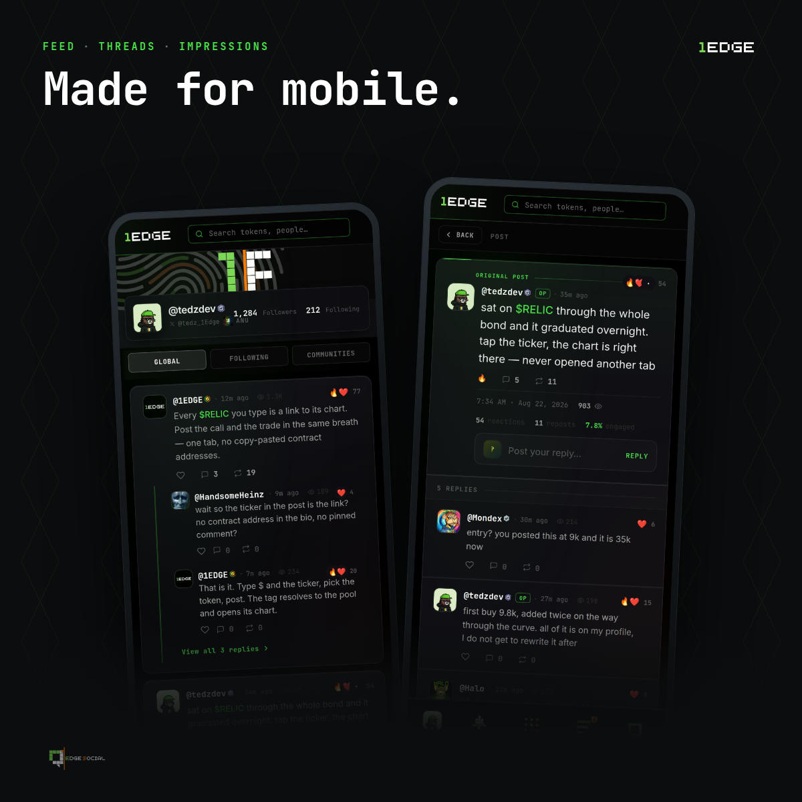

# Notifications & Your Phone

1Edge notifications run on two channels, the **bell** inside the app, and **push** to your phone, controlled by one set of preferences. Mute a category and it's muted everywhere; nothing sneaks back in through the other channel.

## What can notify you

DMs, mentions, replies, reactions, reposts, new followers, community activity, and the traders you've set alerts on.

**The defaults are deliberately quiet.** Out of the box, only **DMs and mentions** push to your phone, everything else stays bell-only until you turn it up. Your phone buzzes for what's aimed at you, not for everything that happens.

## Per-trader alerts

Following someone puts them in your feed. The **bell button on their profile** is a different promise: *interrupt me when they act*, their calls, their buys, as they happen. It's off by default, per trader, so following fifty people never means fifty people can buzz your phone.

## Private by design

* **DM pushes never include the message text.** A lock screen is readable by whoever's holding the phone, and these conversations are about positions and size. You see who messaged, you open the app to read it.
* **Message requests never buzz.** A channel any stranger can open is a channel any stranger could ring your phone through, so only conversations you've accepted can push.

## Your settings

One panel, reachable from two places: **Dashboard → Settings → Notifications**, or in Edge Social under **Notifications → Settings**. Every category has its own in-app and push switch.

## On your phone

1Edge installs as an app, full-screen, home-screen icon, push notifications:

* **Android**: open 1Edge in **Chrome** and choose **Install app** (or "Add to Home screen"). It must be Chrome or Samsung Internet, installing from inside a wallet's in-app browser creates a shortcut that looks like the app but can't receive push.
* **iPhone**: open 1Edge in **Safari**, Share → **Add to Home Screen**. On iOS, push notifications only work from the installed app (iOS 16.4+), that's an Apple rule, not ours.

## Related

* [The Edge Social Engine](edge-social-engine.md)
* [Getting Started](../introduction/getting-started.md)
