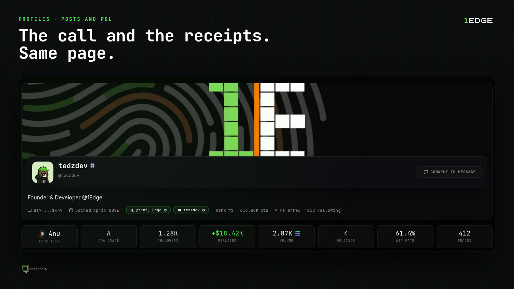
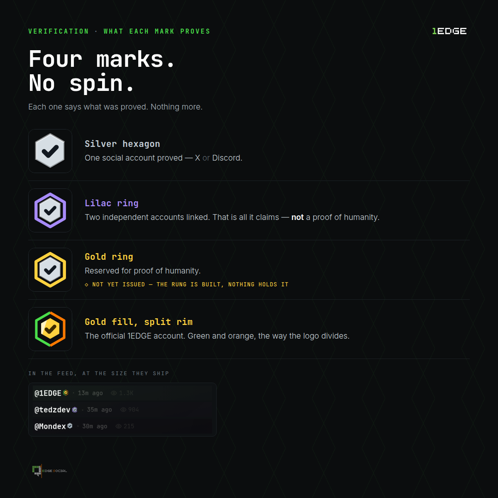

# Profiles & Handles

Every verified human on 1Edge gets a profile, a handle, avatar, bio, and a public track record. It's worth being precise about what lives where, because it's a mix:

* **Your profile and handle are platform data**, your username, avatar, banner, and bio are stored by 1Edge, not written to the chain. They're how you present yourself across [Edge Social](edge-social-engine.md).
* **Your performance is on-chain**, your trading volume, PnL, win rate, and transaction history are read **directly from the Solana blockchain**, so the numbers attached to your profile can't be faked. See [Verified Ledger Performance](verified-metrics.md).

> ℹ️ Think of it as a **platform identity with an on-chain reputation**: the name is yours to set, but the stats are the chain's to prove.

## Setting up your profile

* **Connect & verify**, connect your wallet and bind your [Proof of Humanity](../index.md) status. That's what makes you a real, single-wallet human on the platform.
* **Custom visuals**, upload an avatar and banner.
* **Bio & handle**, describe yourself or your project and claim a unique handle that others can `@`-mention across [Edge Social](edge-social-engine.md).

## Verification marks

Next to a handle you'll see at most one small hexagon mark. Each one says exactly what was proved, nothing more:

* **Silver hexagon**, one social account proved (X or Discord). It reads "Connected", not "Verified", and it names the account, so the claim is checkable.
* **Lilac ring**, two independent accounts linked. That is all it claims, it is **not** a proof of humanity.
* **Gold ring**, reserved for a future proof-of-humanity rung. Built, not yet issued.
* **Gold fill with the green-and-orange rim**, the official 1Edge account, and only that. See [Make sure it's really us](../support/getting-help.md#make-sure-its-really-us).

## On-chain identity stamps

Linking an account does more than light up a mark. You're offered to **stamp it onto your on-chain record**, and the stamp is designed so it can't be gamed:

* **A stamp is keyed to the account, not the wallet.** The same X account can never back two wallets, the chain itself rejects the second attempt. That's enforced by Solana's runtime, not by our servers, so anyone can verify a stamp without trusting 1Edge.
* **One provider, one stamp.** The mark counts independent pieces of evidence, linking the same kind of account twice adds nothing.
* **A stamp upgrades the record you hold**, it never mints a second identity.

> ℹ️ Marks can never be bought and never move with trading volume. Identity rank and [fee-rebate tiers](../rewards/tier-matrix.md) are deliberately separate axes.

## Related

* [Verified Ledger Performance](verified-metrics.md), the on-chain stats attached to every profile.
* [The Edge Social Engine](edge-social-engine.md), how profiles plug into the social layer.
