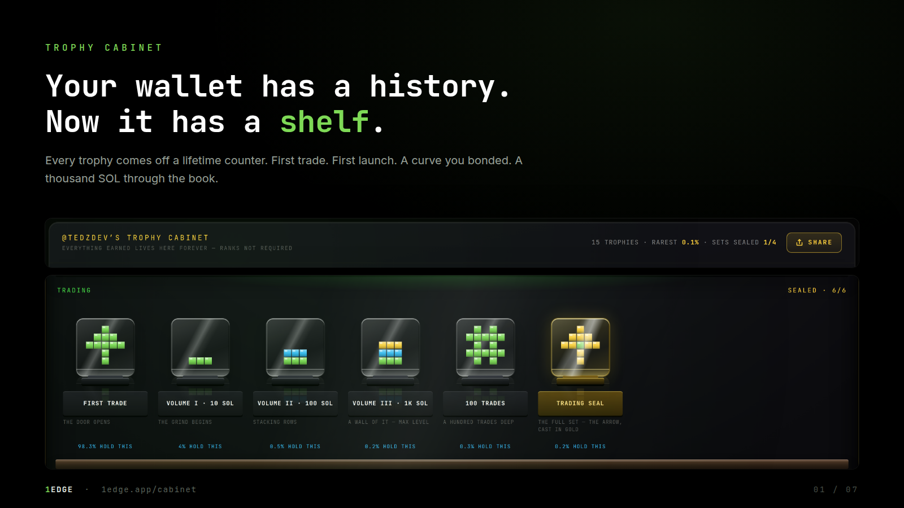
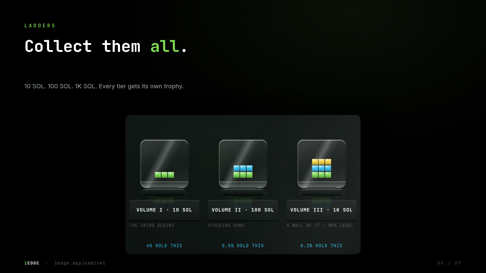
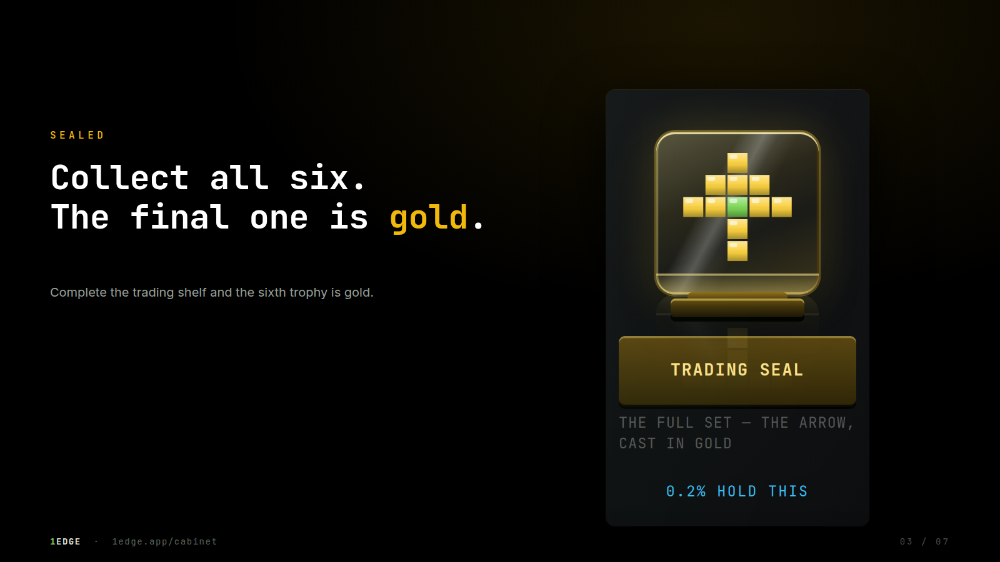
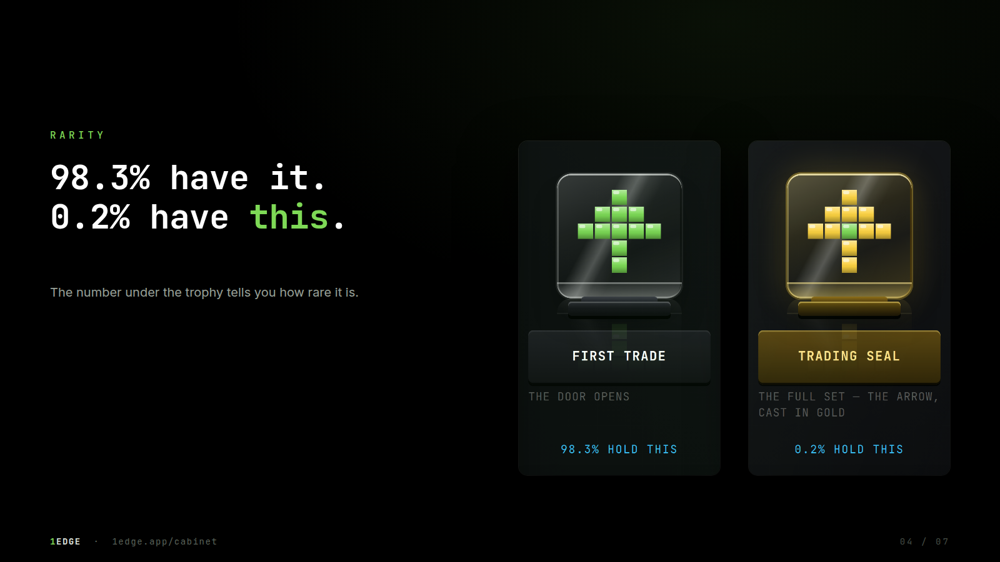

# The Trophy Cabinet

Your wallet has a history. Now it has a shelf.

Every trophy in the cabinet comes off a lifetime counter: your first trade, your first launch, a curve you bonded, a thousand SOL through the book. Nothing in it is bought, nothing in it is given, and nothing in it goes away.

## Where it is

* **Your own cabinet**: the Dashboard, under the **Cabinet** tab.
* **Anyone else's**: their public profile, under the **Cabinet** tab. A cabinet is public by design, it is the part of a track record you cannot fake.

## The terms

> ✅ **You can't buy one. You can't move one. They never reset.** Trophies are earned, not bought. Once earned, they are yours.

Three things a trophy is **not**, so nobody reads it as something it isn't:

* **Not on-chain and not an NFT.** A trophy is a record 1Edge keeps about what a wallet did. It is not a token in your wallet.
* **Not transferable.** It belongs to the wallet that earned it and cannot be sent, sold or lent.
* **Not worth anything.** A trophy has no cash value and pays nothing. It is a fact about your history, cast in glass.

## The shelves

The cabinet is arranged as shelves, one per kind of activity. Each stand on a shelf is one trophy; a ladder trophy gets one stand per rung, so Volume I, II and III each have their own plinth.

| Shelf | What stands on it |
|---|---|
| **Launchpad** | First Launch · Bonded I, II, III (one, three, ten curves of yours that graduated) · Crowd Puller (100 holders on one of your launches) |
| **Trading** | First Trade · Volume I, II, III (10, 100 and 1,000 SOL through the book) · 100 Trades |
| **Crew** | Recruiter I to V (one, five, ten, fifty and a hundred people you referred who verified) |
| **Voice** | First Post · First Call · Reach 1K, 10K, 50K (unique readers of your posts) · Caller I, II, III (five, twenty-five and a hundred calls) · Bullseye I, II, III (a call that did a 2×, a 10×, a 50× from the mark it was made at) |
| **Vault** | Emerald Hands · Ruby Hands · Diamond Hands (held a token from low to a 10×, a 100×, a 500×, **and took profit**) |
| **Modes · Tek & Edge** | First Tek Trade · First Edge Trade · Tek Ape and Edge Ape I, II, III (10, 50 and 250 buys in that mode) · Rode the Bond (bought into a launch and held it through graduation, one trophy per bond) · First Tek Launch · First Edge Launch · Tek Bonded and Edge Bonded (one per launch of yours that graduated) |

> ℹ️ **The Vault is about taking money off the table.** Emerald, Ruby and Diamond Hands are earned on the price you *sold* at over the price you *paid*, so a paper 100× that round-trips to zero earns nothing. Averaging up moves your entry and lowers the multiple, which is correct: buying more on the way up is a different act from holding what you bought at the bottom. Your own launches don't count, a creator selling into their own pump is a dev sell, not a diamond hand.

## Ladders

Some trophies come in tiers. Collect them all.

10 SOL. 100 SOL. 1K SOL. Every tier gets its own trophy, and the rungs you have reached are lit while the ones ahead stand dark, so the cabinet shows what is left as clearly as what is done.

## Seals

Complete a shelf and the last trophy comes in gold.

The **Launchpad, Trading, Crew, Voice and Modes** shelves each close with a seal, awarded when every stand on that shelf is filled. Gold glass exists nowhere else in the product: if you see it on a profile, that person finished a set.

## Rarity

The number under a trophy tells you how rare it is.

Rarity is the share of all cabinet holders who have that trophy, read live. First Trade is close to everyone. A seal is a fraction of a percent. The number moves as the population does, so a trophy that is common today can become rare, and the other way round.

## What's left

The cabinet also shows the stands you have **not** filled, in silhouette, with what each one takes. It is the to-do list for your track record.

## Sharing

Every trophy has a share card, from the trophy itself. The card is drawn from the same record the cabinet reads, so what you post is what you earned.

## Related

* [Profiles & Handles](profiles-and-identity.md)
* [Verified Ledger Performance](verified-metrics.md)
* [The Edge Social Engine](edge-social-engine.md)
